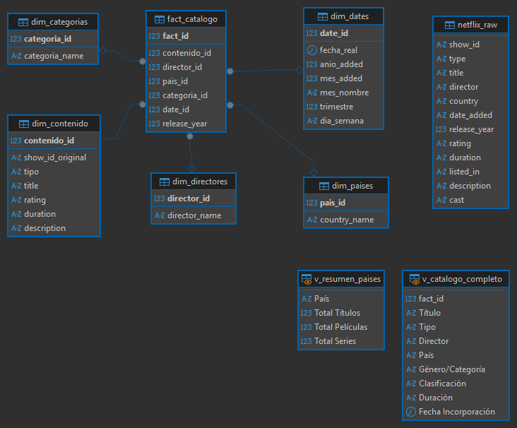

# Data Warehouse de Netflix: ETL, Modelado Relacional y EDA Avanzado

Este proyecto se centra en el diseño, implementación y explotación de un Data Warehouse (modelo estrella) a partir de un conjunto de datos bruto de Netflix (`netflix_raw`). Incluye todo el proceso de limpieza de datos, normalización de cadenas complejas y automatización de análisis estratégicos para la toma de decisiones de negocio.

## 📂 Estructura del Repositorio

/
├── data/                       # Datos originales (raw)
│
├── 01_schema/                  # Scripts SQL de creación del esquema (Tablas de dimensiones y hechos)
│
├── 02_data/                    # Carga y población del Data Warehouse y creación de vistas (Capa semántica)
│ 
├── 03_eda/                     # Consultas analíticas (EDA)
│
├── .gitignore                  # Archivo de exclusión de Git
│
├── README.md                   # Documentación principal del repositorio
│
├── modelo_estrella.png         # Imagen del diseño del Data Warehouse (Hechos y Dimensiones)
└── modelo_netflix.mwb          # Modelo Entidad-Relación visual en MySQL Workbench

---

## 📊 Diagrama de la Base de Datos (Modelo Estrella)

Aquí se detalla la estructura lógica del Data Warehouse implantado, donde se observa la tabla de hechos central y sus respectivas dimensiones + dos vistas:

## 🚀 Desafío Técnico: Del Contratiempo a la Limpieza (ETL)

El proyecto partió de una única tabla plana llamada `netflix_raw`, la cual presentaba graves problemas de calidad de datos para un entorno relacional:
* **Cadenas multivariables:** Celdas en las columnas de países, directores y categorías que contenían listas separadas por comas (ej. *"United States, India, United Kingdom"*), lo que impedía análisis agrupados directos.
* **Datos nulos y faltantes:** Registros con valores `Unknown` o vacíos que distorsionaban las métricas.
* **Tipos de datos incorrectos:** Campos de duración mezclados con texto (ej. *"90 min"*) que impedían cálculos matemáticos y estadísticos.

**La Solución:** Se aplicó un proceso de normalización y carga en un **Modelo Estrella** compuesto por una tabla de hechos (`fact_catalogo`) y dimensiones optimizadas (`dim_paises`, `dim_directores`, `dim_categorias`, `dim_contenido` y `dim_dates`). Para la explotación analítica final, se desarrollaron cruces de proximidad mediante operadores `LIKE` y `CONCAT`, aislando las variables individuales sin perder la integridad del dato original.

---

## 📊 Preguntas de Negocio Resueltas (EDA)

El script `03_eda.sql` está estructurado para dar respuesta a **5 bloques de preguntas estratégicas** de la plataforma mediante SQL avanzado:

### 1. ¿Cómo se distribuye el catálogo global y dónde se produce?
* **Distribución de Formato:** Identifica el peso de películas frente a series. Revela que el catálogo está volcado al cine con un **69.59% (6.131 títulos)** frente a un **30.41% de series (2.676 títulos)**.
* **Top Geográfico:** Desglosa los 10 principales mercados utilizando la capa semántica limpia, evidenciando el liderazgo absoluto de **Estados Unidos (3.684)** y la **India (1.046)**.

### 2. ¿Cuál es el comportamiento de producción y las alianzas en España?
* **Co-producciones Internacionales:** Analiza la tasa de apertura de la industria española. Descubre que de **232 títulos** con sello español, **145 son producciones puras** locales y **87 son alianzas internacionales** (co-producciones), demostrando un perfil de industria altamente colaborativo (~37.5%).

### 3. ¿Cómo ha evolucionado el catálogo históricamente y según la época del año?
* **Evolución Cronológica (1942-2021):** Muestra el ritmo de expansión de Netflix. Identifica el **pico histórico de 2019 con 2.015 incorporaciones** y una posterior desaceleración estratégica.
* **Estacionalidad de Estrenos:** Mediante funciones de ventana (`RANK() OVER`), determina que las campañas vacacionales de **Julio (Puesto 1 - 826)** y **Diciembre (Puesto 2 - 813)** concentran el grueso de los lanzamientos mundiales.

### 4. ¿Qué perfiles de creadores, géneros y audiencias dominan la plataforma?
* **Directores más prolíficos:** Revela los cineastas con más volumen analizando participaciones individuales (liderado por Rajiv Chilaka con 22 obras de animación infantil).
* **Densidad de Categorías:** Clasifica los géneros más frecuentes, destacando el podio de *Movies*, *Dramas* e *International Movies*.
* **Análisis de Madurez:** Segmenta el catálogo por control parental, demostrando que Netflix es una plataforma volcada al público adulto (**3.205 títulos en TV-MA**), pero que usa el contenido infantil (*TV-Y/TV-Y7*) en formato serie para fidelizar familias.

### 5. ¿Podemos optimizar la infraestructura tecnológica y entender las regiones con analítica avanzada?
* **Estrategia IT y Servidores:** Implementación de una función personalizada (`f_clasificar_duracion`) y estructuras `CASE` para clasificar contenidos. Los de mayor volumen (*Películas Estándar* y *Series*) se marcan automáticamente como **"Prioridad Alta en Servidores"** para su pre-carga en nodos locales (CDN) y reducción de latencia.
* **Análisis de Preferencia Cruzada:** Uso de **CTEs encadenadas** (`WITH`) y funciones analíticas de partición (`ROW_NUMBER`) para extraer el Top 3 de géneros por país, demostrando empíricamente que la India consume cine puro, el Reino Unido balancea con series y EE.UU. explota el cine y la comedia masiva.

---

## 🛠️ Tecnologías Utilizadas

* **SQL Avanzado (MySQL Server):** Implementación nativa de la base de datos mediante código puro, desarrollando de forma manual la estructura del Data Warehouse (esquema en estrella). Incluye el uso de expresiones de tabla comunes encadenadas (CTEs), funciones analíticas de ventana (`RANK`, `ROW_NUMBER`), funciones personalizadas de usuario (UDF), transformaciones explícitas de tipos (`CAST`, `REPLACE`) y agrupaciones condicionales complejas.
* **DBeaver:** Utilizado como cliente de desarrollo principal conectado al motor **MySQL**, facilitando la administración del entorno, el testeo, la optimización de las 12 consultas del EDA y la generación automática del diagrama relacional.